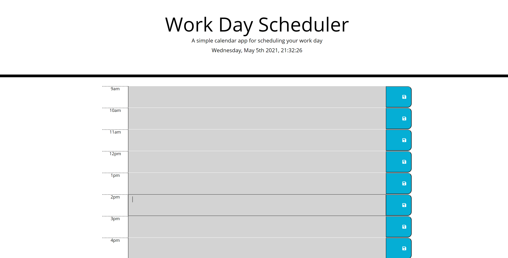

# work-day-scheduler

## Acceptance Criteria

Create a simple calendar application that allows a user to save events for each hour of the day by modifying starter code. This app will run in the browser and feature dynamically updated HTML and CSS powered by jQuery.

I am using a daily planner to create a schedule.  When the planner is opened the current day is displayed at the top of the calendar and when I scroll down I am presented with timeblocks for standard business hours that are color coded for past present and future.  When I click into a timeblock events can be entered and saved to local storage by clicking the save button.  Refreshing the page will not erase entries!

### installation

**Visit my page deployed via Github:**
https://malicea0783.github.io/work-day-scheduler/

**Clone my repo**
https://github.com/malicea0783/work-day-scheduler.git

